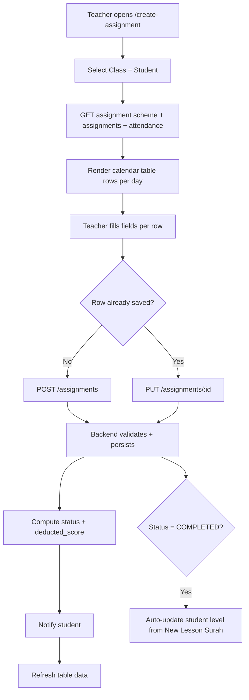
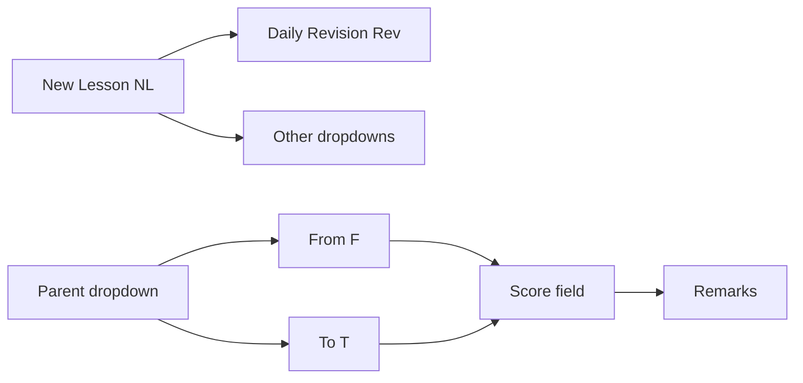
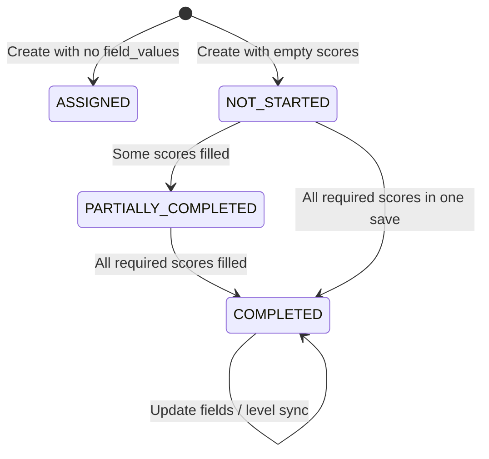
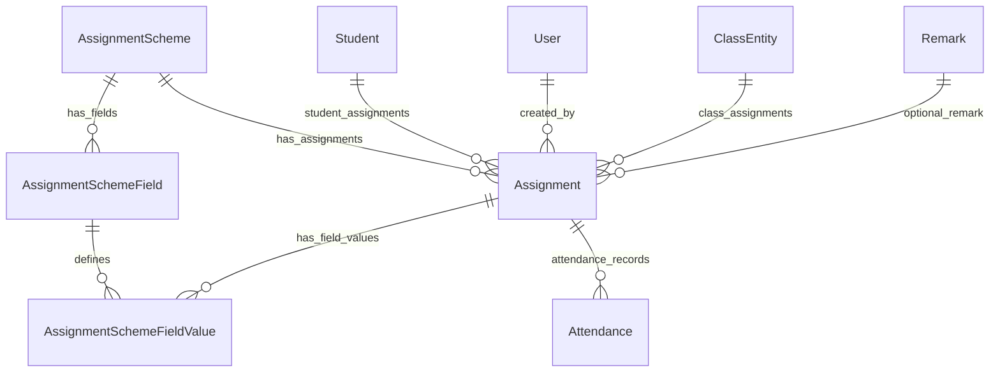

# Create Assignment Module — Comprehensive Documentation

> Cross-cutting reference for the teacher-facing **Create Assignment** feature (frontend + backend).
> Last updated: June 2026.

---

## Table of Contents

1. [Module Overview](#1-module-overview)
2. [Field and Configuration Analysis](#2-field-and-configuration-analysis)
3. [Conditions and Business Rules](#3-conditions-and-business-rules)
4. [Automations and System Behaviors](#4-automations-and-system-behaviors)
5. [Workflow Mapping](#5-workflow-mapping)
6. [Exception Handling](#6-exception-handling)
7. [Technical Documentation](#7-technical-documentation)
8. [Recommendations](#8-recommendations)

---

## 1. Module Overview

### Purpose and business objectives

The **Create Assignment** module is the teacher-facing workspace for recording daily Quranic study progress for students. It supports:

- **Daily homework / progress tracking** aligned to an **Assignment Scheme** (configurable form template per education path and book).
- **Structured memorization data**: New Lesson (Surah + ayat range + score), Daily Revision, Last 5 Pages, mistakes, behavior, etc.
- **Operational constraints**: class schedule, holidays, attendance, role-based edit windows, and academic rules (e.g. blocking New Lesson after poor revision scores).
- **Student communication**: notifications when assignments are created or updated.
- **Progress reporting**: monthly progress summary (`EndOfMonthTable`) and integration with student level updates on completion.

### End-to-end workflow



**Typical user journey:**

1. Navigate to `create-assignment` (optionally via `?classId=&studentId=&educationPathId=`).
2. Select class and student (`SelectStudentByClassId`).
3. System loads scheme, historical assignments, and attendance (`useAssignmentScheme.fetchSchemesByStudent`).
4. Teacher edits one calendar row (current day, next working day, or past day depending on role).
5. Click **Save** on the row → create or update via API.
6. Table refreshes; unsaved local draft cleared from `localStorage`.

---

## 2. Field and Configuration Analysis

### 2.1 Assignment Scheme (template)

Defined in `furqan-lms-backend/prisma/client/schema.prisma`:

| Entity | Purpose |
|--------|---------|
| `AssignmentScheme` | Named template: `name`, `education_path_ids[]`, `book_id`, `status` |
| `AssignmentSchemeField` | Column definition for the table |
| `Assignment` | One record per student per class per calendar day |
| `AssignmentSchemeFieldValue` | Stored value per field per assignment |

### 2.2 Scheme field configuration

| Property | Type | Purpose |
|----------|------|---------|
| `field_type` | `TEXT`, `NUMBER`, `DROPDOWN`, `CHECKBOX`, `RADIO`, `TOGGLE`, `DATE`, `TIME` | Controls UI renderer in `TableCellRenderer.tsx` |
| `label` | string | Display / matching key (often camelCase for predefined fields, e.g. `newLesson`) |
| `abbreviation` | string | Short column header (`NL`, `Rev`, `F`, `T`, etc.) |
| `show_score` | boolean | Whether score appears in grade views |
| `grade_table` | boolean | Places field in the **right** (grade/score) table |
| `is_required` | boolean | Scheme-level required flag |
| `order_index` | int | Column order |
| `max_score` | int? | Max for score fields; checkbox checked = `max_score`, unchecked = `0` |
| `options` | string[] | Static dropdown/checkbox options |
| `linked_entity_type` | `SURAH`, `CHAPTER`, `PAGES` | Dynamic dropdown from base DB |
| `linked_entity_ids` | int[] | Optional filter of linked entities |
| `field_config` | JSON | Extended config (see below) |

**Common `field_config` keys:**

| Key | Used for | Effect |
|-----|----------|--------|
| `allow_multiselect` | DROPDOWN | Multi-surah selection; stored in `values[]` + JSON `value` |
| `linked_to_field_id` | F, T, score fields | Parent dropdown (e.g. score linked to NL or Rev) |
| `field_type: "SCORE"` | NUMBER | Marks field as a score field |
| `placeholder` | All | UI placeholder text |

### 2.3 Predefined field catalog

From `furqan-lms-frontend/packages/ui/src/constants/assignmentSchemeLabels.constant.ts`:

| Label | Abbrev | Type | Typical role |
|-------|--------|------|--------------|
| New Lesson | `NL` | DROPDOWN (Surah) | Primary forward progress |
| Daily Revision | `Rev` | DROPDOWN (Surah, multiselect) | Revision of prior surahs |
| From / To | `F` / `T` | NUMBER | Ayat range for parent dropdown |
| Score fields | e.g. ends in `S` | NUMBER | Linked to parent via `linked_to_field_id` |
| Last 5 Pages | `L5P` | CHECKBOX | Binary completion (0 or max_score) |
| Mistakes | `MST` | NUMBER | Error count |
| Alerts | `ALT` | NUMBER | Alert count |
| No of Pages | `NP` | NUMBER | Defaults to **10** in UI when empty |
| Lesson | `Lsn` | TEXT | Free text |
| Behaviour | `BH` | NUMBER | Behavior score |
| Discipline | `DSP` | TEXT | Notes |
| Other | custom | TEXT | Custom fields |

### 2.4 Assignment-level metadata (not scheme fields)

| Field | Source | Purpose |
|-------|--------|---------|
| `scheme_id` | Required | Which template |
| `assigned_to_student_id` | Required in practice | Target student |
| `class_id` | Required (Joi) | Class context |
| `assignment_date` | Required | Calendar day (one assignment per student/class/day) |
| `assignment_day` | Required | `DAYS_NAME` enum (MONDAY…SUNDAY) |
| `listener_ids` | Optional int[] | Users who listened (teacher, peers) |
| `remark_id` | Optional | Predefined remark lookup |
| `status` | Auto or manual | `ASSIGNED`, `NOT_STARTED`, `PARTIALLY_COMPLETED`, `COMPLETED` |
| `deducted_score` | Auto | `sum(max_score) - sum(earned_score)` for filled score fields |
| `branch_id` | Auto | Creator's branch (null for `INDIVIDUAL_OWNER`) |
| `assigned_by` | Auto | Client user ID of creator |

### 2.5 UI-only row fields

| Key | Purpose |
|-----|---------|
| `attendance_field_id` | Display/auto-populate; not sent in assignment payload |
| `listener_ids` | Mapped to assignment `listener_ids` |
| `remark` | Mapped to `remark_id` |

### 2.6 Table layout

`SideBySideTables` splits fields into:

- **Left table**: primary fields (dropdowns, F/T, non–grade-table fields).
- **Right table**: `grade_table` fields and linked scores.
- **Fixed columns**: Date, Day, Attendance, Listener (`LN`), Remarks (`REM`), Total Score, Save.

---

## 3. Conditions and Business Rules

### 3.1 Authorization and permissions

| Rule | Who | When |
|------|-----|------|
| Module permission `create_assignment` | All API access | `create`/`update`/`delete` require `CUSTOMIZED` study scheme |
| Role gate | Teachers, Branch Managers, Org Owners, Individual Owners | `validateTeacherRole` on create/update/delete |
| Teacher class authorization | Teachers | Must be primary, assistant, or substitute for the class |
| Live class (create, today only) | Teachers, Individual Owners | `CLASS_STARTED` session required for **today's** date only |
| Live class or 24h window (update) | Teachers, Individual Owners | Today: class must be live; after end: editable within 24 hours |
| Full edit | Branch Manager, Org Owner, Individual Owner (+ `student_assignment` permission) | Past and current days broadly editable |
| View-only | Read without create/update, or old education path view | All fields disabled |

### 3.2 Date and calendar rules (frontend)

| Condition | Effect |
|-----------|--------|
| Holiday (class + semester ranges) | Row disabled (`isDisabled`) |
| Non-class day (per schedule / compensation) | Row disabled |
| Future beyond next working day | Not editable for anyone |
| Next working day only | Planning allowed: dropdowns + F/T; **no scores, remarks, or listeners** |
| Attendance restriction on student | Entire row disabled |
| `enableCurrentAndNextDayOnly` (teachers) | Only current + next working day editable |

### 3.3 Field dependency chain (frontend)



| Rule | Trigger | Outcome |
|------|---------|---------|
| New Lesson first | Any non-NL dropdown | Blocked until NL has a value |
| From/To after dropdown | F or T | Requires parent dropdown selected |
| Score after From/To | Score fields | Requires both F and T filled (saved or in-progress) |
| Score priority | NL score before Rev score | Higher-priority predefined scores must exist in **saved** backend data |
| Remarks last | REM | All score fields must have backend values |
| Daily Revision bypass | NL blocked by revision rule | Rev dropdown/F/T/score still allowed to "unlock" NL |

### 3.4 Daily Revision / Last 5 Pages — New Lesson blocking

**Frontend** (`furqan-lms-frontend/apps/client/utils/dailyRevisionValidation.ts`):

- Uses the **last two days that actually have assignments** (skips absent/holiday gaps).
- Blocks NL (and linked F/T/score) when **either**:
  - Daily Revision score = 0 on both days, **or**
  - Last 5 Pages score = 0 on both days.
- Applies on **current day** and **next working day**.

**Backend** (`furqan-lms-backend/src/services/assignment.service.ts`):

- Looks at **calendar previous 2 days** (not "last 2 assignment days").
- Requires **≥ 2 assignments** in that window.
- Blocks if Daily Revision **or** Last 5 Pages has explicit 0 on **all** assignments in range.
- On block: rejects non-empty New Lesson content with HTTP 400.
- On same-day zero Rev/L5P: New Lesson score becomes **optional** for `COMPLETED` status (`determineAssignmentStatus`).

> **Note:** Frontend and backend use **different day-selection logic** — see [Recommendations](#81-high-priority).

### 3.5 Score and status rules (backend)

**Status** (`determineAssignmentStatus`):

| Filled score fields | Status |
|---------------------|--------|
| 0 | `NOT_STARTED` |
| Some, not all required | `PARTIALLY_COMPLETED` |
| All required | `COMPLETED` |

**New Lesson optional:** If Daily Revision or Last 5 Pages has explicit **0** in current payload, New Lesson score is excluded from required count.

**Deducted score:** Only fields whose label contains `"score"` (case-insensitive) with non-empty values; `earned > max` → 400 error.

### 3.6 Surah / ayat rules (frontend, `TableCellRenderer.tsx`)

| Rule | Behavior |
|------|----------|
| Study order `ASC` / `DESC` | Controls NL sort; Rev uses **opposite** order |
| Daily Revision filter | Only surahs at or before student's NL progress point |
| Multiselect auto-sort | Surahs re-sorted on selection |
| F validates against first surah in sorted list; T against last | Ayat max = `total_ayats` |
| Single surah | To ≥ From |
| Score = 0 | Orange highlight ("repeat lesson") |
| NP (No of Pages) | Auto-defaults to 10 when editable and empty |

### 3.7 Duplicate and attendance rules (backend)

| Rule | Error |
|------|-------|
| One assignment per student/class/day | 400 if duplicate |
| Student not in class | 404 |
| Student absent / absent with excuse | 400 |
| Invalid Surah/Chapter/Page IDs | 400 with missing IDs |
| Score > max_score | 400 |

### 3.8 Linked entity storage

- API accepts **numeric IDs** for `SURAH`, `CHAPTER`, `PAGES`.
- Stored as strings in DB; multiselect uses `values[]` + JSON.
- Responses convert IDs back to **names** for display.

---

## 4. Automations and System Behaviors

| Automation | Trigger | Outcome |
|------------|---------|---------|
| **New assignment notification** | Successful `createAssignment` | `NotificationService.notifyNewAssignment` → student in-app notification |
| **Update notification** | Successful `updateAssignment` | `notifyAssignmentUpdated` |
| **Student level update** | Assignment reaches `COMPLETED` on update | Reads New Lesson Surah ID → finds matching `StudentLevel` by surah range → updates `student_level_id` |
| **Status auto-compute** | Create/update with `field_values` | `determineAssignmentStatus` |
| **Deducted score recalc** | Create/update field values | `deducted_score = max - earned` |
| **Absent-day suggestion** | Student absent prior working day | Copies previous day's assignment into current/future empty rows + toast |
| **localStorage draft** | Unsaved edits, date range change | `saveUnsavedValues` / `mergeUnsavedValues`; cleared on save or student/class change |
| **Auto-scroll** | Non–full-edit users | Scrolls to today's row |
| **Monthly progress** | Class + student selected | `useStudentProgress.calculateMonthlyProgress` |
| **Date range expansion** | Custom date filter | `expandDateRangeForValidation` fetches extra prior days for revision validation |
| **Field value seeding** | Page load / refresh | `populateFieldValuesFromSharedData` maps API assignments to row indices |
| **No-of-pages default** | Editable NP cell | Defaults to 10 via `useEffect` in `TableCellRenderer` |

**No cron/queue** is tied directly to assignment creation; notifications are fire-and-forget (errors logged, not rolled back).

---

## 5. Workflow Mapping

### 5.1 Assignment lifecycle



### 5.2 Row-level save flow

1. Teacher edits cells → `handleInputChange` → row marked in `changedRows`.
2. Save clicked → `handleSaveRow` builds payload:
   - Filters out `attendance`, empty values, empty arrays.
   - Converts Surah/Chapter IDs to numbers.
3. `CreateAssignmentService.saveAssignment`:
   - **POST** `/assignments` if no `assignmentIds[rowIndex]`.
   - **PUT** `/assignments/:id` if exists.
4. Backend transaction:
   - Duplicate check
   - Daily revision filter
   - Create assignment + all scheme field values (empty string for unset fields)
5. Frontend clears `changedRows`, localStorage, calls `onDataRefresh`.

### 5.3 Role interaction matrix

| Action | Teacher (today) | Teacher (past) | Manager / Owner |
|--------|-----------------|----------------|-----------------|
| Plan next working day (NL, F/T) | Yes | N/A | Yes |
| Score today | Only if class live | If `isEditPermission` | Yes |
| Score past | No (unless permission) | If `isEditPermission` | Yes |
| Edit >24h after class end | No | No | Yes |

### 5.4 Approval flows

There is **no explicit approval workflow** in this module. Status is computed from data entry, not manager sign-off.

---

## 6. Exception Handling

### 6.1 API validation errors (Joi + service)

| Scenario | HTTP | Message pattern |
|----------|------|-----------------|
| Missing `scheme_id`, `assignment_date`, `assignment_day` | 400 | Joi validation |
| Invalid `field_id` / `field_label` | 400 | Field not found + available fields list |
| Duplicate assignment | 400 | One per student/class/day |
| Class not live (teacher, today) | 400 | Only when class is live |
| Update outside 24h window | 400 | Live or within 24h after end |
| Unauthorized teacher | 400 | Substitute/authorization message |
| Forbidden role | 403 | Teachers/managers/owners only |
| Absent student | 400 | Attendance check |
| New lesson blocked (backend) | 400 | 0 scores previous 2 days |
| Score exceeds max | 400 | Per-field max |
| Invalid linked entity IDs | 400 | Missing Surah/Chapter/Page IDs |
| Scheme / student / class not found | 404 | Resource not found |

### 6.2 Frontend handling

- Save errors → `toast.error` via `formatErrorResponse`.
- Validation messages → red border + tooltip via `getValidationMessage`.
- Blocked fields → `isFieldEditable` returns false; read-only mode for saved/disabled rows.
- Backend validation failure in `validateDailyRevisionScore` → **fails open** (allows creation; logs error).

### 6.3 Edge cases

| Edge case | Behavior |
|-----------|----------|
| Old education path (`isOldPathView`) | Read-only banner |
| Student with no scheme for path | "No assignment scheme available" |
| Scheme with zero fields | Configuration warning |
| Class selected, no student | Yellow prompt |
| Multiselect backward compatibility | JSON parse fallback in API responses |
| Branch transfer | Old assignments keep original `branch_id` |
| Checkbox L5P vs backend `last5pagesscore` label | Backend `isFieldType('last5Pages')` expects label containing `last5pagesscore`; checkbox field may be `last5Pages` — matching may fail for L5P blocking on backend |

---

## 7. Technical Documentation

### 7.1 Frontend

| Layer | Path |
|-------|------|
| Page | `furqan-lms-frontend/apps/client/app/[locale]/create-assignment/page.tsx` |
| Orchestrator | `furqan-lms-frontend/apps/client/app/[locale]/create-assignment/components/CreateAssignmentClient.tsx` |
| Table UI | `furqan-lms-frontend/apps/client/app/[locale]/create-assignment/components/SideBySIdeTable.tsx` |
| Cell renderer | `furqan-lms-frontend/apps/client/components/createAssignment/TableCellRenderer.tsx` |
| Hooks | `furqan-lms-frontend/apps/client/hooks/useCreateAssignment.ts`, `useFieldEditability.ts`, `useAssignmentScheme.ts`, `useAssignmentData.ts` |
| Validation | `furqan-lms-frontend/apps/client/utils/fieldValidationUtils.ts`, `dailyRevisionValidation.ts` |
| API wrapper | `furqan-lms-frontend/apps/client/services/createAssignment.service.ts` |
| Shared API | `furqan-lms-frontend/packages/ui/src/services/assignment.service.ts` |

### 7.2 Backend

| Layer | Path |
|-------|------|
| Routes | `furqan-lms-backend/src/routes/assignment/assignment.route.ts` |
| Controller | `furqan-lms-backend/src/controllers/assignment/assignment.controller.ts` |
| Service | `furqan-lms-backend/src/services/assignment.service.ts` |
| Validation schemas | `furqan-lms-backend/src/schemas/assignment/assignment.schema.ts` |
| Field helpers | `furqan-lms-backend/src/helpers/fieldNormalization.helper.ts` |
| Permissions | `furqan-lms-backend/src/middleware/permissions/assignment.permission.middleware.ts` |
| Scheme fetch | `furqan-lms-backend/src/services/assignmentScheme.service.ts` → `GET /assignment-schemes/student/:studentId` |

### 7.3 API endpoints

| Method | Path | Purpose |
|--------|------|---------|
| `POST` | `/assignments` | Create |
| `PUT` | `/assignments/:id` | Update metadata + field values |
| `PUT` | `/assignments/:id/status` | Manual status change |
| `GET` | `/assignments/:id` | Single fetch |
| `GET` | `/assignments` | List with filters |
| `GET` | `/assignments/student/:studentId` | By student |
| `DELETE` | `/assignments/:id` | Delete |
| `GET` | `/assignment-schemes/student/:studentId` | Scheme + assignments + attendance bundle |

### 7.4 Database relationships



### 7.5 Related modules

| Module | Relationship |
|--------|--------------|
| **Assignment Scheme Builder** | Defines fields consumed here |
| **Attendance** | Gates creation; auto-suggest on absence |
| **Class Sessions** | Live-class enforcement |
| **Substitute Teacher** | Authorization helper |
| **Student Progress** | Monthly summary table |
| **Holidays** | Row disabling |
| **Surah/Chapter (base DB)** | Linked dropdown data |
| **Notifications** | Student alerts |
| **Student Level** | Updated on completion |
| **Student app assignments view** | Read-only mirror (`apps/student/.../SideBySideTables.tsx`) |

### 7.6 Field normalization (`fieldNormalization.helper.ts`)

Labels are normalized by lowercasing and stripping spaces/underscores/hyphens. Special types:

- `dailyRevision` → label contains `dailyrevisionscore`
- `last5Pages` → label contains `last5pagesscore`
- `newLesson` → contains `newlesson`
- `newLessonScore` → contains `newlessonscore`

This coupling between **label text** and business logic is central to backend rules.

---

## 8. Recommendations

### 8.1 High priority

1. **Align Daily Revision logic between frontend and backend**  
   Frontend uses "last 2 assignment days"; backend uses "previous 2 calendar days." Teachers can see different UI vs API errors. Unify on one rule and share a single utility (or server-side validation only).

2. **Fix Last 5 Pages field type mismatch on backend**  
   `isFieldType('last5Pages')` looks for `last5pagesscore`, but the predefined field is a **checkbox** `L5P` / `last5Pages`. Backend blocking and status optional logic may not apply to L5P as intended.

3. **`ASSIGNMENT_STATUS` vs `VIEWED`**  
   `updateAssignmentStatus` references `VIEWED`, but the Prisma enum only has `ASSIGNED`, `COMPLETED`, `PARTIALLY_COMPLETED`, `NOT_STARTED`. Either add `VIEWED` to the enum or remove dead code.

4. **Remove debug `console.log` in production path**  
   `determineAssignmentStatus` and update class-session checks log to console.

### 8.2 Maintainability

5. **Centralize business rules** — Field priority, revision blocking, and status computation are split across multiple files. A shared rules package or backend-only source of truth would reduce drift.

6. **Replace label-string matching with stable field keys** — Use `abbreviation` or `field_config.rule_key` instead of `label.toLowerCase().includes('score')`.

7. **Document `field_config` JSON schema** — `linked_to_field_id`, `allow_multiselect`, `field_type: SCORE` are critical but undocumented in DB comments.

### 8.3 Usability

8. **Surface backend errors in-row** — Save failures only show toast; row stays "changed" without inline context.

9. **Clarify `ASSIGNED` vs `NOT_STARTED`** — Create defaults to `ASSIGNED` when no `field_values`, but `determineAssignmentStatus` uses `NOT_STARTED` when scores are empty.

10. **Fix attendance error typo** — "Canot mark absent..." and clarify product policy for excused absence.

### 8.4 Performance

11. **`formatAssignmentResponse` N+1 queries** — Batch user lookups for list endpoints.

12. **Surah fetch loads 150 per page initially** — Consider virtualized dropdown + server search for large books.

### 8.5 Automation

13. **Student level update on create** — Level sync only runs on **update** when status is `COMPLETED`, not on create.

14. **Notification type for updates** — `notifyAssignmentUpdated` uses `NOTIFICATION_TYPE.NEW_ASSIGNMENT`; consider a distinct type.

15. **Fail-closed on revision validation errors** — Backend `validateDailyRevisionScore` catch block returns `false` (allow).

---

## Examples

### Example: Create payload (simplified)

```json
{
  "scheme_id": 3,
  "assigned_to_student_id": 42,
  "class_id": 7,
  "assignment_date": "2026-06-12T10:30:00.000Z",
  "assignment_day": "THURSDAY",
  "listener_ids": [101, 102],
  "remark_id": 5,
  "field_values": [
    { "field_id": 10, "value": 15 },
    { "field_id": 11, "value": 1 },
    { "field_id": 12, "value": 7 },
    { "field_id": 13, "value": 8 }
  ]
}
```

Where field `10` might be NL (Surah ID 15), `11`/`12` From/To, `13` score.

### Example: Status outcomes for three score fields (NL, Rev, L5P)

| NL score | Rev score | L5P | Result |
|----------|-----------|-----|--------|
| empty | empty | empty | `NOT_STARTED` |
| 8 | empty | empty | `PARTIALLY_COMPLETED` |
| 8 | 7 | 1 | `COMPLETED` |
| empty | 0 | 7 | `PARTIALLY_COMPLETED` (NL optional when Rev=0) |

---

## Summary

The Create Assignment module is a **configuration-driven, calendar-based data entry system** for Quranic study tracking. Its complexity concentrates in **date-aware editability**, **field dependency chains** (NL → Rev → scores → remarks), and **Daily Revision / Last 5 Pages gating** of New Lesson progress. The frontend provides rich validation and UX; the backend enforces persistence, authorization, scoring math, notifications, and partial academic rules.
